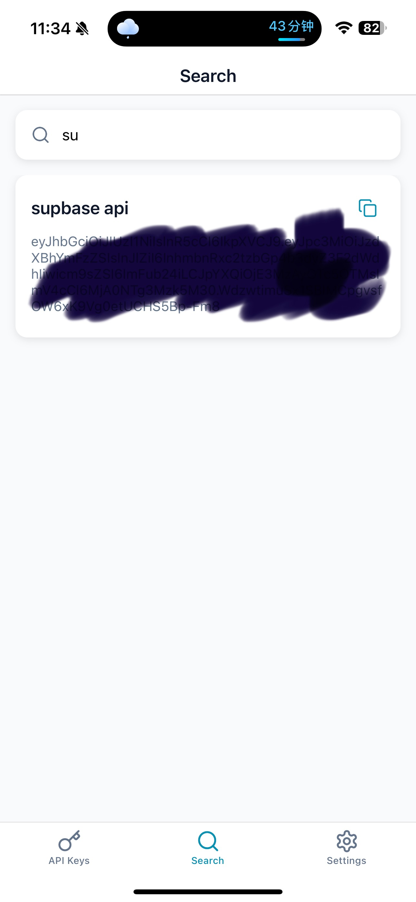
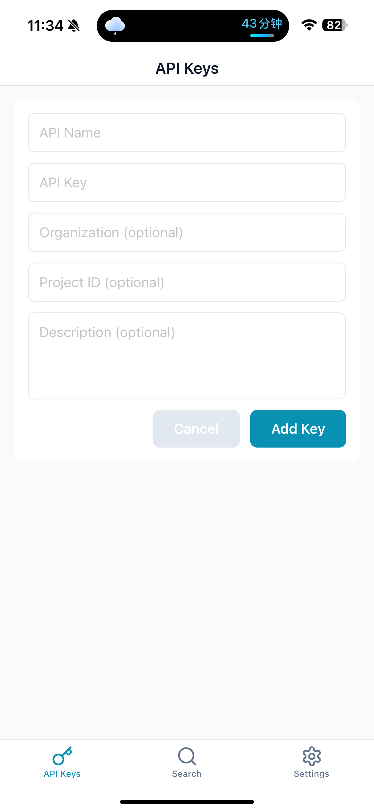

# API Manager

A React Native application built with Expo and TypeScript to manage API interactions.

## Screenshots

<div align="center">
  
  
</div>

## Features

- React Native application with Expo framework
- TypeScript for type safety
- Expo Router for navigation
- SQLite for local database storage
- Multiple Expo libraries and features integrated

## Prerequisites

- Node.js (16.x or higher)
- npm or yarn
- Expo CLI

## Installation

1. Clone the repository
   ```
   git clone <repository-url>
   cd api-manager
   ```

2. Install dependencies
   ```
   npm install
   # or
   yarn install
   ```

3. Start the development server
   ```
   npm run dev
   # or
   yarn dev
   ```

## Project Structure

- `/app` - Main application screens and navigation
- `/assets` - Images, fonts, and other static assets
- `/hooks` - Custom React hooks
- `/utils` - Utility functions and helpers

## Scripts

- `npm run dev` - Start the Expo development server
- `npm run build:web` - Build the web version of the app
- `npm run lint` - Run the linter

## Dependencies

This project uses various Expo and React Native libraries including:
- expo-router
- expo-sqlite
- react-native-reanimated
- And many more (see package.json for the complete list)

## License

[Your License Here]

## Contributing

[Your Contribution Guidelines Here] 